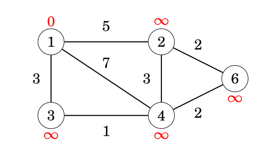
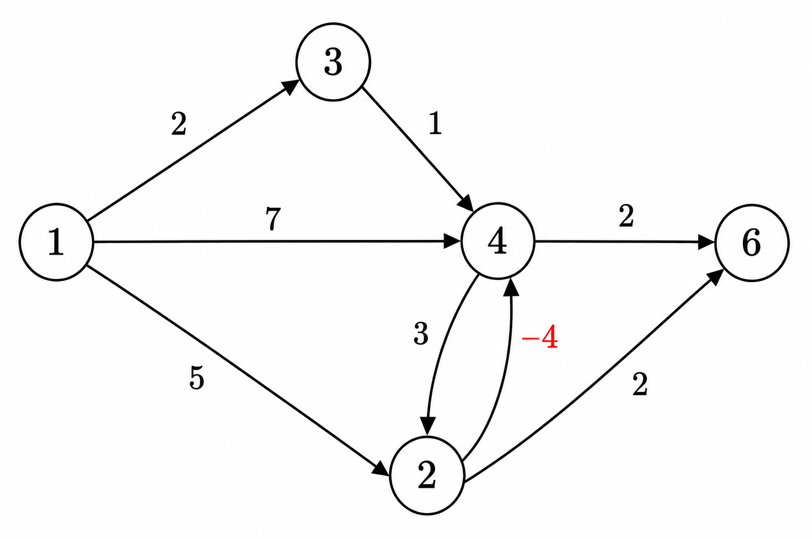

# Bellman–Ford Algorithm

The Bellman–Ford algorithm **finds shortest paths from a starting node to all nodes of the graph**. The algorithm can process all kinds of graphs, **provided that the graph does not contain a cycle with negative length**. If the graph contains a negative cycle, the algorithm can detect this.

> The algorithm is named after R. E. Bellman and L. R. Ford who published it independently in 1958 and 1956, respectively [5, 24].

The algorithm keeps track of distances from the starting node to all nodes of the graph. Initially, the distance to the starting node is `0` and the distance to all other nodes is infinite. The algorithm reduces the distances by finding edges that shorten the paths until it is not possible to reduce any distance.

## Example

Let us consider how the Bellman–Ford algorithm works on a sample graph.

  
Each node of the graph is assigned a distance. Initially, the distance to the starting node is `0`, and the distance to all other nodes is infinite.

### Steps

For edge list:

```
(4,6,2)
(2,6,2)
(3,4,1)
(2,4,3)
(1,4,7)
(1,2,5)
(1,3,2)
```

| Node | Initial | After Pass 1 | After Pass 2 | After Pass 3 | After Pass 4 |
| ---- | ------- | ------------ | ------------ | ------------ | ------------ |
| 1    | 0       | 0            | 0            | 0            | 0            |
| 2    | ∞       | 5            | 5            | 5            | 5            |
| 3    | ∞       | 2            | 2            | 2            | 2            |
| 4    | ∞       | 7            | 3            | 3            | 3            |
| 6    | ∞       | ∞            | 9            | 5            | 5            |

After this, no edge can reduce any distance. This means that the distances are final, and we have successfully calculated the shortest distances from the starting node to all nodes of the graph.

### Implementation

- The graph is stored as an edge list edges, where each tuple (a, b, w) represents an edge from node a to node b with weight w.
- The algorithm runs for n − 1 rounds.
- In each round, it iterates through all edges and attempts to reduce distances.
- It constructs a distance array that holds the shortest distance from x to every node.
- The constant INF represents an infinite (unreachable) distance.

```cpp
//#include <tuple>        // std::tuple, std::make_tuple, std::tie
for (int i = 1; i <= n; i++) distance[i] = INF;
distance[x] = 0;

for (int i = 1; i <= n - 1; i++) {
    for (auto e : edges) {
        int a, b, w;
        tie(a, b, w) = e;
        distance[b] = min(distance[b], distance[a] + w);
    }
}
```

### Implementation(with early stopping)

```cpp
bool changed = true;
for (int i = 1; i <= n - 1 && changed; i++) {
    changed = false;
    for (auto e : edges) {
        int a, b, w;
        tie(a, b, w) = e;
        if (distance[b] > distance[a] + w) {
            distance[b] = distance[a] + w;
            changed = true;
        }
    }
}
```

### Time complexity

The **time complexity** of the algorithm is `O(nm)`, because the algorithm consists of `n − 1` rounds and iterates through all `m` edges during each round. If there are no negative cycles in the graph, all distances are final after `n − 1` rounds, because each shortest path can contain at most `n − 1` edges.

> **Optimization:** In practice, the final distances can usually be found faster than in `n − 1` rounds. A possible way to make the algorithm more efficient is to stop early if no distance can be reduced during a round.

### Negative Cycles

The Bellman–Ford algorithm can also be used to check if the graph contains a cycle with negative length.

For example, a graph containing cycle `2 → 3 → 4 → 2` with length `−4` has a negative cycle.

If the graph contains a negative cycle, we can shorten infinitely many times any path that contains the cycle by repeating the cycle again and again. Thus, the concept of a **shortest path** is not meaningful in this situation.

A negative cycle can be detected using the Bellman–Ford algorithm by running the algorithm for `n` rounds. If the last round reduces any distance, the graph contains a negative cycle. Note that this can be used to search for a negative cycle in the whole graph regardless of the starting node.

Example graph:

```
(4,6,2)
(2,6,2)
(3,4,1)
(2,4,-4)
(4,2,3)
(1,4,7)
(1,2,5)
(1,3,2)
```

  

| Node | Initial | Pass 1 | Pass 2 | Pass 3 | Pass 4 (V−1) | Pass 5 (Check) |
| ---- | ------- | ------ | ------ | ------ | ------------ | -------------- |
| 1    | 0       | 0      | 0      | 0      | 0            | 0              |
| 2    | ∞       | 5      | 4      | 3      | 2            | **1**          |
| 3    | ∞       | 2      | 2      | 2      | 2            | 2              |
| 4    | ∞       | 7      | 1      | 0      | -1           | **-2**         |
| 6    | ∞       | ∞      | 7      | 3      | 2            | **1**          |
