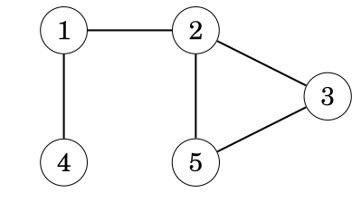
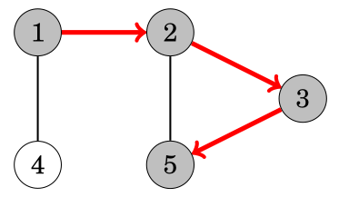

# Depth first search

|     |     |
| --- | --- |
|       |       |
| Step 1      | Step 2     |
|       |       |
| Step 3      | Step 4     |

## 1. How It Works

### Recursive DFS

DFS is implemented using the **call stack** implicitly managed by the compiler. Each recursive call pushes a new frame onto the system stack.

```cpp
#include <bits/stdc++.h>
using namespace std;

void dfsRec(int u, const vector<vector<int>>& adj, vector<bool>& visited) {
    visited[u] = true;
    cout << u << " ";

    for (int v : adj[u]) {
        if (!visited[v])
            dfsRec(v, adj, visited);
    }
}
```

### Iterative DFS (Explicit Stack)

DFS is implemented using an **explicit `std::stack`** on the heap. The programmer manually pushes/pops nodes.

```cpp
#include <bits/stdc++.h>
using namespace std;

void dfsIter(int start, const vector<vector<int>>& adj) {
    vector<bool> visited(adj.size(), false);
    stack<int> st;

    st.push(start);

    while (!st.empty()) {
        int u = st.top();
        st.pop();

        if (visited[u]) continue;
        visited[u] = true;
        cout << u << " ";

        for (int v : adj[u]) {
            if (!visited[v])
                st.push(v);
        }
    }
}
```

---

## 2. Mechanism Comparison

| Aspect | Recursive DFS | Iterative DFS (Stack) |
|---|---|---|
| **Storage** | System call stack | Explicit `std::stack` on heap |
| **Managed by** | Compiler/runtime | Programmer |
| **Push/Pop** | Automatic via function calls | Manual `push()` / `pop()` |
| **Return info** | Each frame holds return address, locals, params | Only the node data you choose to store |

---

## 3. Memory & Overhead

### Recursive DFS

- Each call frame stores: return address, local variables, parameters (~dozens of bytes per call)
- For a graph with max depth `D`, stack usage ≈ `D × frame_size`
- Risk of **stack overflow** on deep graphs (default stack is ~1–8 MB depending on OS)

### Iterative DFS

- `std::stack<int>` stores only the node identifier (4–8 bytes per entry)
- Allocated on the **heap**, so limited by available RAM (~GBs)
- Much more memory-efficient per level of traversal

---

## 4. Pros and Cons

| Feature | Recursive DFS | Iterative DFS |
|---|---|---|
| Code Simplicity | Clean, minimal code | More boilerplate code |
| Readability | Easy to reason about (linear control flow) | Slightly harder to reason about |
| Stack Safety | Stack overflow on deep graphs; higher memory overhead per frame | No stack overflow risk; heap memory is abundant |
| Traversal Control | Hard to pause/resume mid-traversal | Easier to extend (store extra state per node) |
| Visit Order | Natural mapping to tree/graph structure | Visit order differs from recursion (neighbors reversed unless you reverse the push order) |

### Note on Visit Order

The iterative version visits neighbors in **reverse** order compared to recursion, because a stack is LIFO. To match recursive order, push neighbors in reverse:

```cpp
for (auto it = adj[u].rbegin(); it != adj[u].rend(); ++it) {
    if (!visited[*it]) st.push(*it);
}
```

---

## 5. When to Prefer Which

| Scenario | Preferred |
|---|---|
| Competitive programming, clean code | **Recursive** |
| Deep or large graphs (depth > ~10⁴) | **Iterative** |
| Need to store custom state per level | **Iterative** (push pairs/tuples onto stack) |
| Limited stack size (embedded systems, some online judges) | **Iterative** |
| Small/medium trees and graphs | Either works; recursive is cleaner |

---

## 6. TL;DR

- **Recursion** = implicit stack, cleaner code, risk of overflow on deep graphs.
- **Explicit stack** = heap-based, more control, safe for large inputs, slightly more verbose.

# References

1. [Visual Algo - Graphs](https://www.cs.usfca.edu/~galles/visualization/DFS.html)
