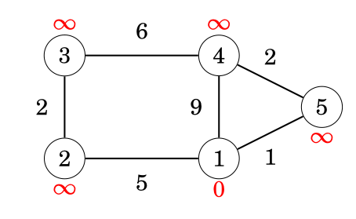

# Dijkstra's Algorithm

Dijkstra's algorithm **finds shortest paths from a starting node to all nodes of the graph**. The algorithm can process all kinds of graphs, **provided that the graph does not contain any edges with negative weights**. If the graph contains negative edge weights, the algorithm's greedy approach may produce incorrect results.

> The algorithm was conceived by Dutch computer scientist Edsger W. Dijkstra in 1956 and published three years later in 1959 [1].

The algorithm keeps track of distances from the starting node to all nodes of the graph. Initially, the distance to the starting node is `0` and the distance to all other nodes is infinite. The algorithm maintains a priority queue of nodes to visit. At each step, it greedily selects the unvisited node with the smallest known distance, finalizes its shortest path, and then reduces the distances to its neighbors if a shorter path is found.

## Example

Let us consider how Dijkstra's algorithm works on a sample graph.
  

Each node of the graph is assigned a distance. Initially, the distance to the starting node is `0`, and the distance to all other nodes is infinite.

### Steps

For edge list:

```
(1,2,5)
(1,4,9)
(1,5,1)
(5,4,2)
(4,3,6)
(2,3,2)

```

| Node | Initial | Process 1 | Process 5 | Process 4 | Process 2 | Process 3 |
| --- | --- | --- | --- | --- | --- | --- |
| 1 | 0 | **0** | 0 | 0 | 0 | 0 |
| 2 | ∞ | 5 | 5 | 5 | **5** | 5 |
| 3 | ∞ | ∞ | ∞ | 9 | 7 | **7** |
| 4 | ∞ | 9 | 3 | **3** | 3 | 3 |
| 5 | ∞ | 1 | **1** | 1 | 1 | 1 |

Once a node is processed (highlighted conceptually by being the smallest unvisited distance at that step), its distance becomes final. No future edge checks will ever reduce a finalized distance.

### Implementation

* The graph is stored as an adjacency list `adj`, where `adj[a]` contains pairs `(b, w)` representing an edge from node `a` to node `b` with weight `w`.
* The algorithm utilizes a priority queue `q` to efficiently extract the node with the minimum distance.
* A boolean array `processed` keeps track of nodes whose shortest path is already finalized.
* The constant `INF` represents an infinite (unreachable) distance.

```cpp
//#include <queue>        // std::priority_queue

for (int i = 1; i <= n; i++) {
    distance[i] = INF;
    processed[i] = false;
}
distance[x] = 0;

// Priority queue stores pairs of (distance, node)
priority_queue<pair<int,int>, vector<pair<int,int>>, greater<pair<int,int>>> q;
q.push({0, x});

while (!q.empty()) {
    int a = q.top().second;
    q.pop();

    if (processed[a]) continue;
    processed[a] = true;

    for (auto u : adj[a]) {
        int b = u.first, w = u.second;
        if (distance[a] + w < distance[b]) {
            distance[b] = distance[a] + w;
            q.push({distance[b], b});
        }
    }
}

```

### Time complexity

The **time complexity** of the algorithm is `O(n + m log m)` when using a standard binary heap (like C++ `std::priority_queue`), where $n$ is the number of nodes and $m$ is the number of edges. The algorithm processes each node exactly once and iterates through all outgoing edges. Every edge evaluation might result in adding a new distance to the priority queue, taking $O(\log m)$ time per push.

> **Optimization:** While the standard C++ `std::priority_queue` cannot decrease the priority of an existing element (resulting in duplicate nodes in the queue), using specialized data structures like a Fibonacci heap can theoretically improve the time complexity to $O(n \log n + m)$. In competitive programming, the binary heap approach is practically always preferred due to lower constant factors.

### Negative Edges

Dijkstra's algorithm requires all edge weights to be non-negative. This is because it relies on the **greedy choice property**: when a node is extracted from the queue, the algorithm assumes its shortest path is permanently found.

If the graph contains negative edges, a path that currently appears longer could theoretically become shorter later, invalidating earlier finalized distances.

Example failing graph:

```
(1,2,1)
(1,3,0)
(2,3,-2)

```

| Node | Initial | Process 1 | Process 3 | Process 2 | True Shortest Path |
| --- | --- | --- | --- | --- | --- |
| 1 | 0 | **0** | 0 | 0 | 0 |
| 2 | ∞ | 1 | 1 | **1** | 1 |
| 3 | ∞ | 0 | **0** | 0 (Fails) | -1 |

When Node 3 is extracted with a distance of `0`, it is marked as processed. Later, when Node 2 is processed, it discovers a path to Node 3 with a cost of $1 + (-2) = -1$. However, because Node 3 is already finalized, the algorithm ignores this update, resulting in an incorrect shortest distance. For graphs with negative weights, the Bellman-Ford algorithm must be used instead.
